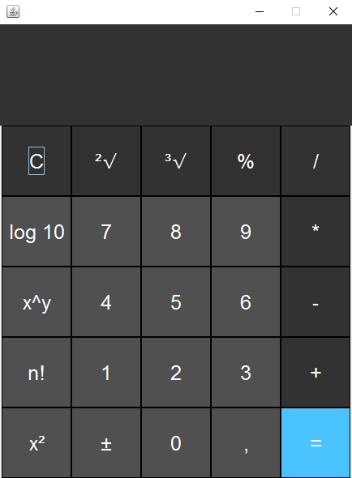

# Calculadora

Este é um projeto simples de uma calculadora em Java.

### Paradigmas utilizados: Orientado a Objeto, Funcional.

### Design Patterns utilizados: Observer, Singleton, Strategy, Open/Closed Principle (OCP)

### Funcionalidades: 

- **Operações Matemáticas**: Soma, Subtração, Multiplicação, Divisão, Raiz quadrada, Raiz cúbica, Logaritmo na base 10, Número elevado ao quadrado, Potenciação, Módulo, Fatorial.

### Links para download:
- [Eclipse IDE](https://www.eclipse.org/downloads/)
- [JDK (Java Development Kit)](https://www.oracle.com/java/technologies/javase-downloads.html)

### Dependências Utilizadas: Todas as dependências utilizadas vêm na API padrão do Java.

### Como utilizar:

1. **Requisitos**: Certifique-se de ter o JDK instalado na máquina.
2. **Clone o Repositório**: 
3. **Execute a Calculadora em uma IDE como o Eclipse**:

   - **Instalação e Configuração do Eclipse**:
      - Certifique-se de ter o Eclipse instalado.
      - Abra o Eclipse e crie um novo Java Project.
      - Importe o projeto baixado: 
        - Selecione "File" (Arquivo) -> "Import" (Importar).
        - Escolha "Existing Projects into Workspace" (Projetos existentes para a área de trabalho) e clique em "Next" (Avançar).
        - Selecione o diretório do seu projeto e clique em "Finish" (Concluir).

   - **Execução do Projeto no Eclipse**:
      - Clique duas vezes na classe principal que contém o método main (`Calculadora`).
      - Após ter aberto, você pode apertar o botão verde de "Run" e com isso o jogo e a interface gráfica podem ser executados.
      - Para realizar operações, clique uma vez em cada botão desejado. O número atual será exibido conforme você clicar nos botões numéricos.
      - Se desejar realizar uma operação, clique no botão correspondente (soma, subtração, etc.). O número atual será armazenado em um buffer e você poderá digitar um novo número.
      - Ao clicar no botão de igual (=), a operação será realizada com o número armazenado no buffer e o número atual.
      - O resultado da operação será exibido após o clique no botão igual.
      - Se preferir realizar uma operação com apenas um número, simplesmente clique no botão da operação desejada (raiz quadrada, logaritmo, etc.). O resultado será exibido imediatamente.
      
        
     
